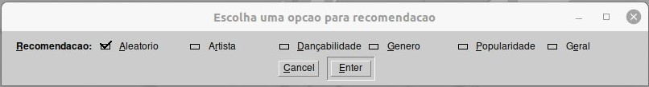
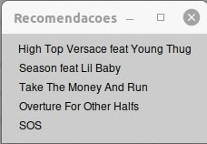
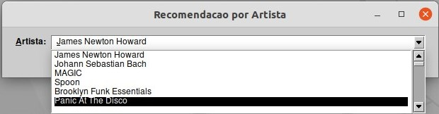
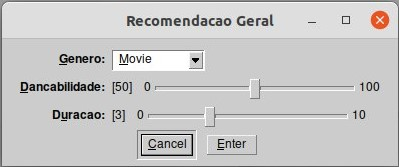
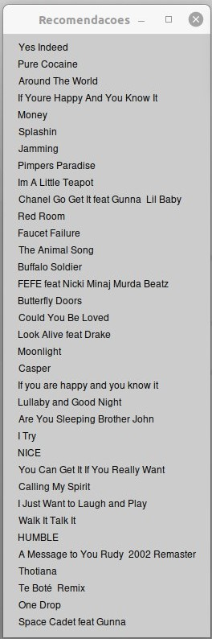

# SpotifyRecomendation

**Disciplina**: FGA0210 - PARADIGMAS DE PROGRAMAÇÃO - T01 <br>
**Nro do Grupo**: 05<br>
**Paradigma**: Lógico<br>

## Alunos
|Matrícula | Aluno | Github |
| -- | -- | -- |
| 180041592  |  Denys Rogeres Leles dos Santos | [@andrelucasf](https://github.com/andrelucasf) |
| 180113259  |  Felipe Correia Andrade | [@Percon12](https://github.com/Percon12) |
| 180103580  |  Jonathan Jorge Barbosa Oliveira|  [@Jonathan-Oliveira](https://github.com/Jonathan-Oliveira) |
| 180125885  |  Lucas Melo dos Santos | [@luucas-melo](https://github.com/luucas-melo) |
| 180127535  |  Mateus Brandao Teixeira | [@mateusbrandaot](https://github.com/mateusbrandaot) |
| 180106821  |  Mateus Gomes do Nascimento | [@matgomes21](https://github.com/matgomes21) |
| 180127641  |  Matheus Afonso de Souza | [@Matheusafonsouza](https://github.com/Matheusafonsouza) |
| 180138545  |  Thiago Mesquita Peres Nunes de Carvalho | [@thiagompc](https://github.com/thiagompc) |
| 180132245  |  Vinicius de Sousa Saturnino | [@viniciussaturnino](https://github.com/viniciussaturnino) |

## Sobre 
Com o intuito de ajudar pessoas a escolher uma música, foi criado o SpotifyRecomendation. O SpotifyRecomendation tarata-se de um projeto focado na recomedação de música para usuários baseado em suas preferências. Neste projeto foi utilizado uma [base da dados pública](https://www.kaggle.com/datasets/zaheenhamidani/ultimate-spotify-tracks-db) filtrada com informações sobre música, artista, gênero, polularidade e etc.

## Screenshots
 <br>


## Instalação 
**Linguagens**: Prolog<br>
**Tecnologias**: SWI-Prolog v8.4.3<br>
**Pré-requisitos** para rodar o SpotifyRecomendation:
- Docker
- SWI-Prolog v8.4.3
**Execução**: Na raiz do projeto execute:
```
docker-compose run generator
```
Após finalizar, execute o comando:
```
swipl -s src/main.pl
```
Dentro do console digite:
```
start.
```

## Uso 
Para utilizar o SpotifyRecomendation é extremamente simples, após rodar o projeto aparecerá um menu com as seguintes opções: <br>
 <br> <br>
Podendo optar por uma recomendação aleatória, geral, por artista, por daçabilidade, por gênero e populariade. <br>
 <br>
 <br> <br>

Após escolher a recomendação desejada, basta clicar no botão "Enter" e uma recomedação será gerada. <br>

 <br>

## Vídeo
[](https://youtu.be/x2oa-ozaf7U)<br>
[Link vídeo](https://youtu.be/x2oa-ozaf7U)

## Participações
Apresente, brevemente, como cada membro do grupo contribuiu para o projeto.
|Nome do Membro | Contribuição | Significância da Contribuição para o Projeto (Excelente/Boa/Regular/Ruim/Nula) |
| -- | -- | -- |
| Denys Rogeres Leles dos Santos  |   |  |
| Felipe Correia Andrade  |   |   |
| Jonathan Jorge Barbosa Oliveira  | Implementação das recomendações por artistas e geral | Excelente |
| Lucas Melo dos Santos  |Implementação de interface gráfica, recomendações por genero, recomendação geral e funções uteis para inserir conteúdo na interface    | Excelente |
| Mateus Brandao Teixeira  |   |  |
| Mateus Gomes do Nascimento  | Implementação das recomendações por popularidade, dançabilidade, geral e por duração, e criação de funções úteis para o projeto. | Excelente |
| Matheus Afonso de Souza  | Criação do script para extração e filtragem dos dados no arquivo csv e montagem do arquivo prolog com a base usada no projeto. Implementação da recomendação por aleatoriedade  | Excelente |
| Thiago Mesquita Peres Nunes de Carvalho  | Implementação das recomendações por popularidade, dançabilidade, geral e por duração, e criação de funções úteis para o projeto. | Excelente |
| Vinicius de Sousa Saturnino  | Criação do script para extração e filtragem dos dados no arquivo csv e montagem do arquivo prolog com a base usada no projeto. Implementação da recomendação por aleatoriedade  | Excelente |

## Melhorias
Melhorias que poderiam ser implementadas:
- Cadastrar usuário e recomendar pelo seu histórico 
- Exportar músicas selecionadas
- Adicionar mais informações sobre a música na interface
- Melhorar a interface (mudar cor, tamanho mínimo da tela, etc)

## Fontes
- Fonte da base de dados utilizada https://www.kaggle.com/datasets/zaheenhamidani/ultimate-spotify-tracks-db
